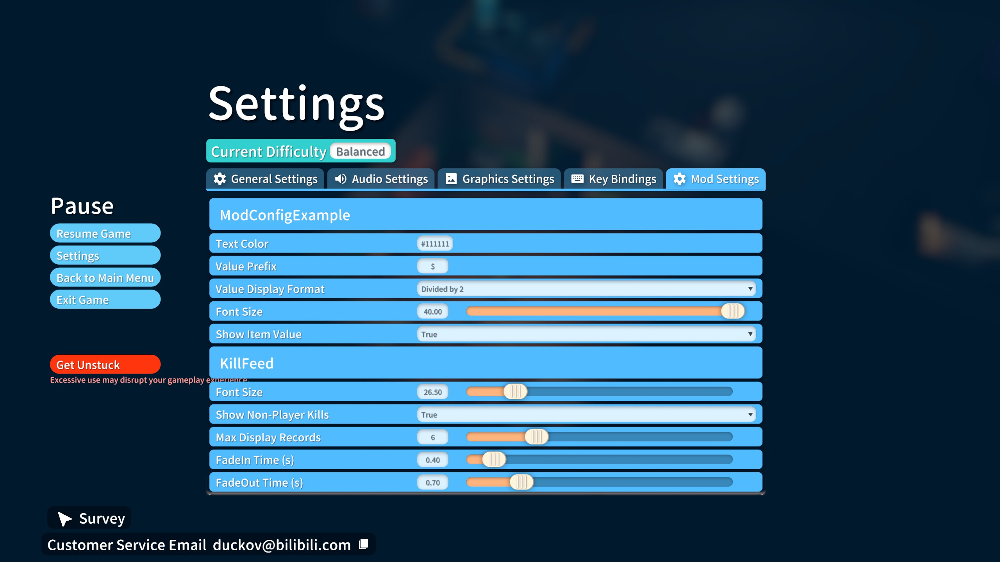

# ModConfigExample
This is an example project showing how to use [ModConfig](https://github.com/FrozenFish259/duckov_mod_config)  

# Tips
* ModManager.OnModActivated += OnModActivated;
* ModConfigAPI.IsAvailable()
* ModConfigAPI.SafeAddOnOptionsChangedDelegate(OnOptionsChanged);